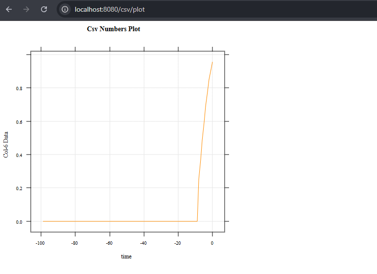
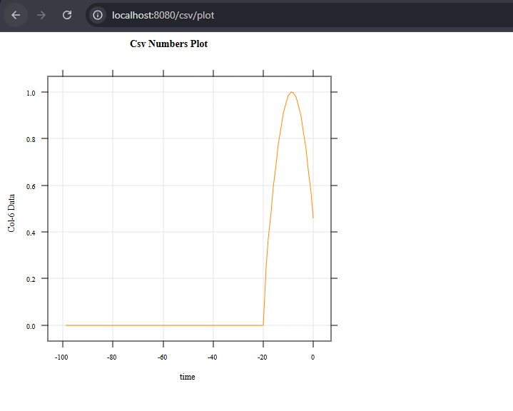
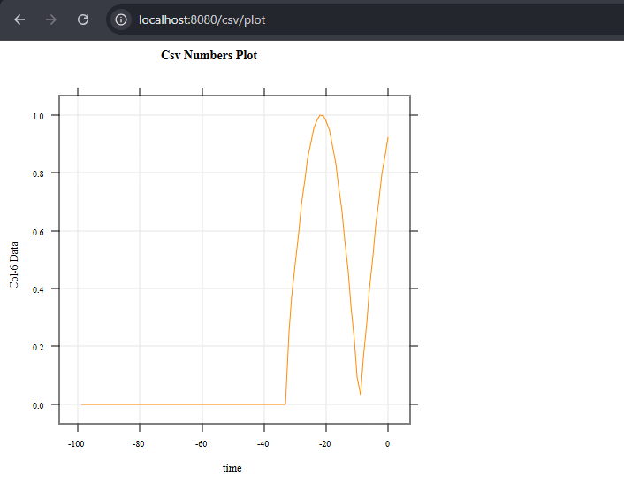

# Polyglot Data Visualization with Spring Boot, MongoDB, and GraalVM (R)

## Project Overview
This project demonstrates a **polyglot backend architecture** for processing numerical data and generating dynamic visual analytics. The application integrates **Spring Boot** for backend logic, **MongoDB** for persistent data storage, and **GraalVM’s Polyglot API** to execute **R (FastR)** scripts for high-quality **SVG-based data visualization**.

The primary objective is to showcase how multiple runtimes and technologies can be combined into a single data pipeline—from ingestion to real-time visualization.

---

## Architecture and Components

### 1. Data Layer (MongoDB)
- **Database:** `swe307_db`
- **Collection:** `data_points`
- **Data Ingestion:** CSV data is imported into MongoDB using `mongoimport`.

**Schema Structure:**
- `rowName`: Row identifier (e.g., `Row-1`, `Row-2`)
- `Col-6`: Numeric value used for plotting

---

### 2. Backend Layer (Spring Boot / Java)
- **Entity Mapping:** Implemented using Spring Data MongoDB with `@Document`.
- **Field Mapping:** The MongoDB field `Col-6` is mapped explicitly to a Java `Double` field.
- **Repository Layer:** Uses `MongoRepository` to retrieve records based on `rowName`.
- **Concurrency Control:**  
  Execution of the GraalVM R function is wrapped in a `synchronized` block to ensure thread safety during polyglot execution.

---

### 3. Analytics Layer (GraalVM & FastR)
- **Runtime:** GraalVM Community Edition (Java 17)
- **Guest Language:** R (FastR), with the `lattice` package installed via `gu`
- **Visualization Logic:**  
  - An R script (`plot.R`) maintains a rolling window of the last 100 data points.
  - Plots are rendered using the `svg()` device.
  - The resulting SVG output is returned directly to the Java host application as a string.

---

## Project Structure
📁 .idea
📁 .mvn
📁 src
├─📁 main
│ ├─📁 java
│ │ └─📁 com
│ │ └─📁 murat
│ │ └─📁 test
│ │ ├─📁 config
│ │ │ └─📄 PlotConfig.java
│ │ ├─📁 controller
│ │ │ └─📄 CsvDataController.java
│ │ ├─📁 dto
│ │ │ └─📄 DataHolder.java
│ │ ├─📁 entities
│ │ │ └─📄 CsvData.java
│ │ ├─📁 repository
│ │ │ └─📄 CsvDataRepository.java
│ │ ├─📁 service
│ │ │ └─📄 CsvDataService.java
│ │ └─📄 TestApplication.java
│ └─📁 resources
│ ├─📁 static
│ ├─📁 templates
│ ├─📄 application.properties
│ └─📄 plot.R
├─📁 test
│ └─📁 java
│ └─📁 com
│ └─📁 murat
│ └─📁 test
│ └─📄 TestApplicationTests.java
📁 target
├─📁 classes
│ └─... compiled classes ...
├─📁 generated-sources
├─📁 generated-test-sources
├─📁 maven-archiver
├─📁 maven-status
└─📁 test-classes
📄 .gitattributes
📄 .gitignore
📄 docker-compose.yml
📄 dockerfile
📄 HELP.md
📄 LICENSE
📄 mvnw
📄 mvnw.cmd
📄 pom.xml
📄 readme.md
📄 users.csv

---

## REST API Endpoints

| Endpoint     | Method | Description |
|-------------|--------|-------------|
| `/csv/col6` | GET    | Returns all `rowName` and `Col-6` values from MongoDB |
| `/csv/plot` | GET    | Iteratively retrieves data, updates the R plot, and returns an SVG image |

📌 The `/csv/plot` endpoint includes an auto-refresh header to simulate real-time data streaming.

---

## Screenshots 

### Plot




---

## Technical Challenges and Solutions

### Duplicate Data and Result Consistency
A critical issue emerged during development due to repeated execution of `mongoimport`.

**Problem:**  
`mongoimport` appends data by default. Multiple imports resulted in duplicate `rowName` values, causing Spring Data to throw an `IncorrectResultSizeDataAccessException` when a unique result was expected.

**Solution:**  
- Ensured that the import process runs only once, or  
- Used the `--drop` flag in `mongoimport` to clear the collection before ingestion

This reinforced the importance of **idempotent data ingestion** when integrating external data sources.

---

### Environment Configuration
Running R inside a Java environment requires native system libraries. A custom Docker image was created where essential dependencies (such as `libgomp1`) were installed to support FastR’s native shared objects (e.g., `libR.so`).

---

## Deployment with Docker
The application is containerized using **Docker Compose**, consisting of:
- `mongodb`: Official MongoDB image
- `java-app`: Custom Ubuntu 22.04 image containing GraalVM CE 17, FastR, and the Spring Boot application

---

## How to Run

> **Note:** Docker and Docker Compose are required. Ensure that you are in the directory containing the `docker-compose.yml` file.

1. Build the application JAR using Maven:
   ```bash
   ./mvnw clean package -DskipTests
    ```
2. Build the image of the app
    ```bash
    docker build -t java-r-graalvm .
    ```
3. Start the containers
     ```bash
    docker-compose up --build
    ```
4. Access the visualization:
     ```bash
    http://localhost:8080/csv/plot
    ```
## Conclusion
This project provided hands-on experience with polyglot programming, containerized backend systems, and cross-runtime data visualization.
The most significant lesson learned was the necessity of controlling data ingestion behavior and ensuring result consistency when working with external data sources and strict repository expectations.